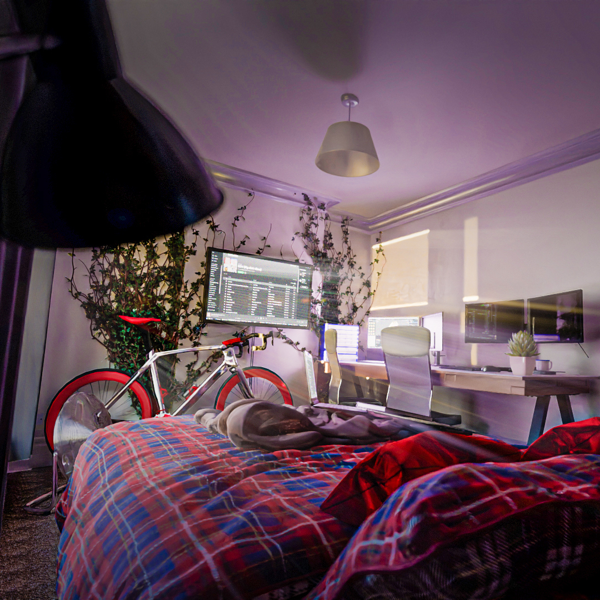
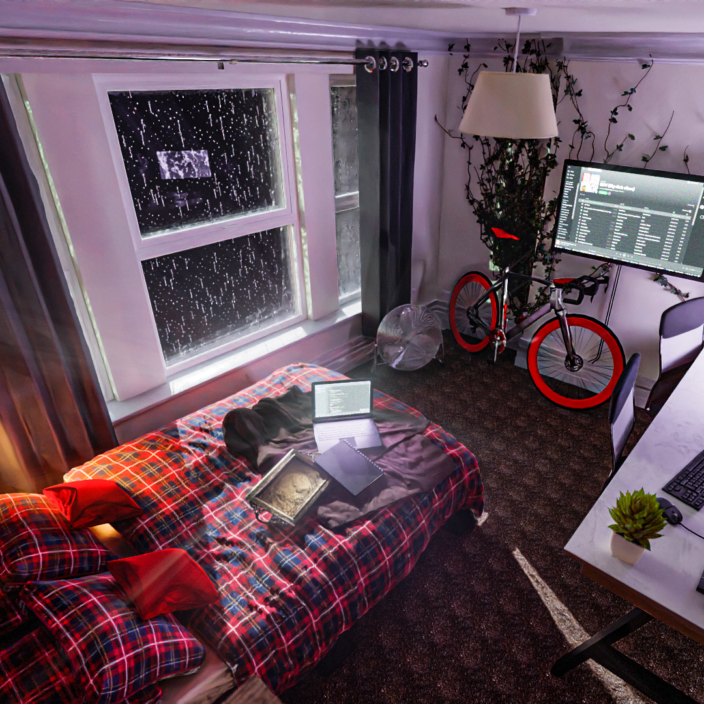
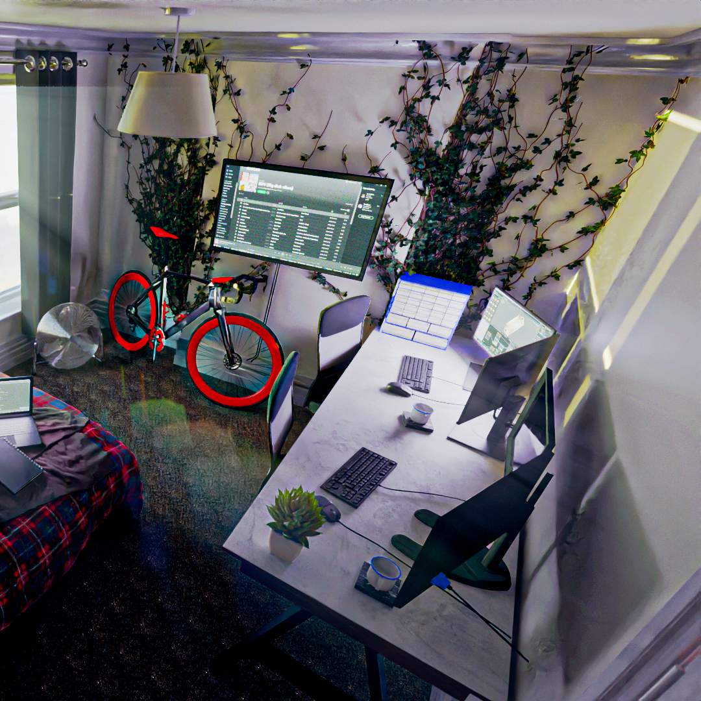

Interior Render Bedroom

Bedroom Render
Recreating my bedroom in blender.
I moved house during lock down giving me a lot of time to plan how I was to organise my new room. I used my 3d skills to recreate my new bedroom as accurately as I could.

I found the building plans on my local council's web portal and got to work with some basic dimensions./static/

I started with a block out of the all the key objects before I committed to placing each of the detailed models. This lead to me combining multiple surfaces into one mega desk so I can have all my technology in one place.

I played around with using a particle system to generate the decorative ivy.

