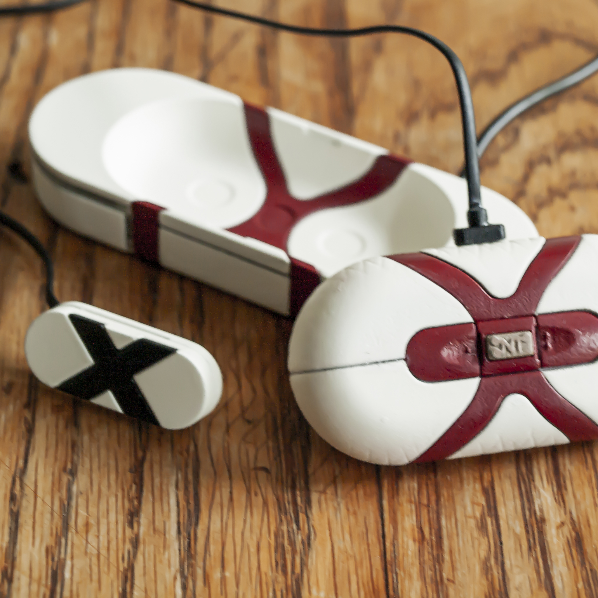

Nervtrac

University final year project
Using heart rate variability to monitor and alert user of anxiety and panic attacks.
By becoming more aware, we become more human.

Nervtrac was my final year project at Loughborough University. It is a device that uses your heart rate variability score to device your levels of anxiety.

When a panic is detected the user is notified through an application. A optional camera can be worn to capture the exact moment that made someone panic. This information can be used to analysis what the situations have in common and help the user better understand their anxiety condition.

For example Nervtrac can be used to improve gaming performance. HRV jumps up during intense moments when precise, fast reactions are required. Nervtrac alerts the user when this happens, giving them a reminded to centre themselves before their emotions run away.

The prototype was made using arduino and processing. Its was designed to work at multiple sizes and for multiple body types.

