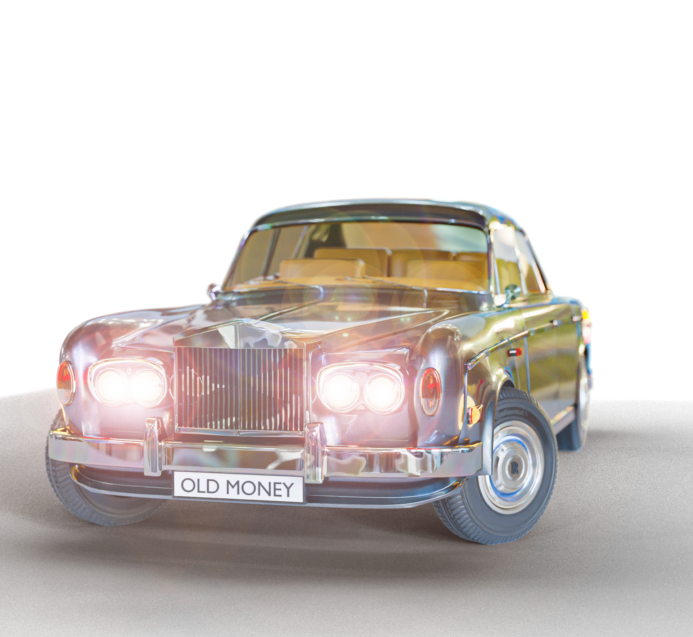
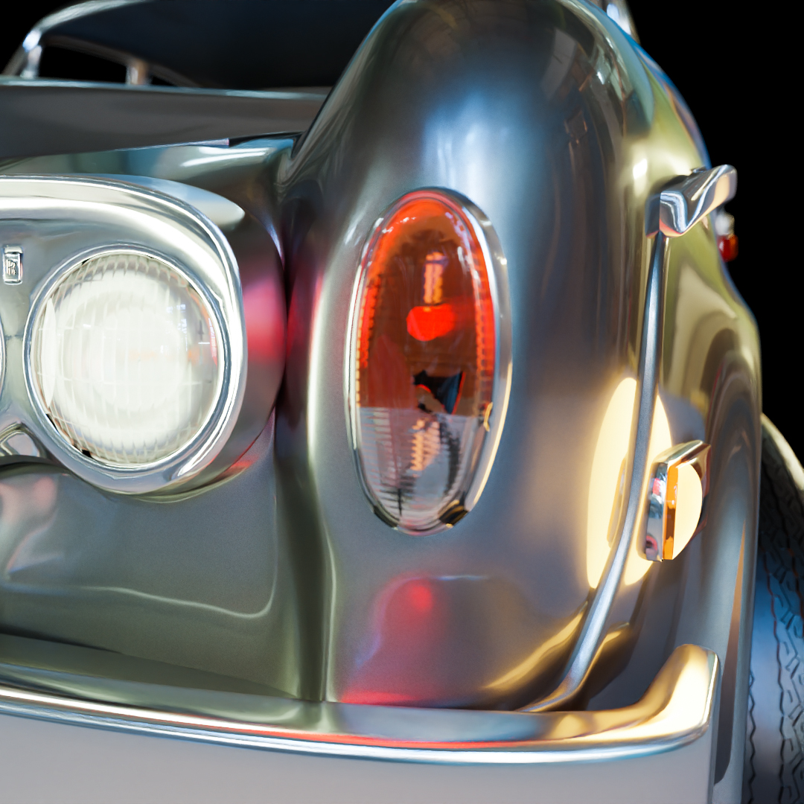
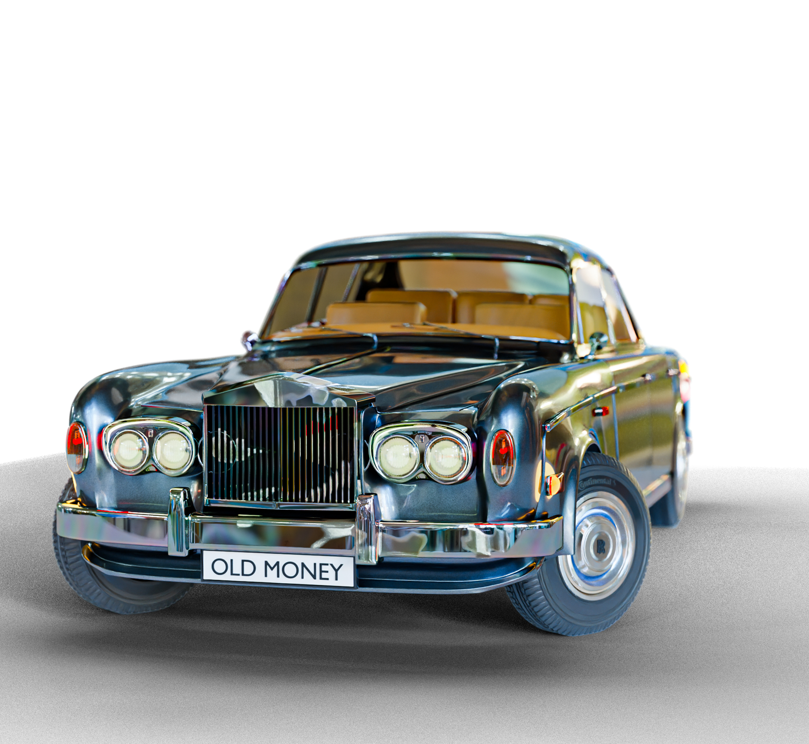
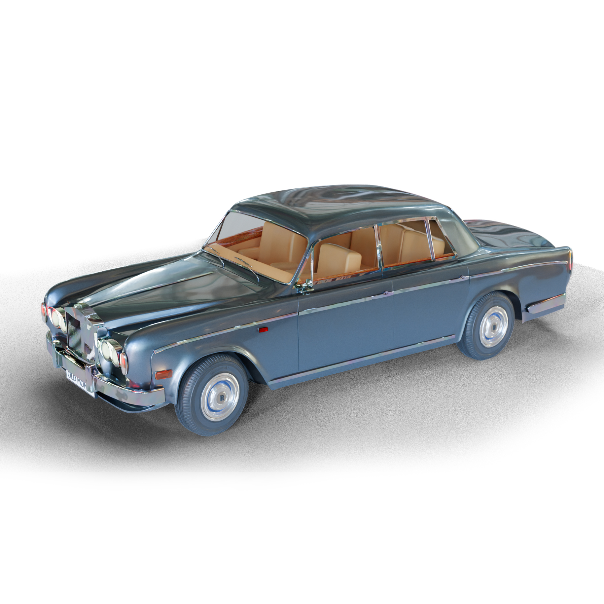

Rolls Royce Model
20/08/20

Silver Shadow
Recreating a classic car in Blender.

Textured and game ready asset

Based on the Rolls Royce Silver shadow.

Technologies used include blender 3d and substance painter.

Armatures we're set up to allow precise control over the wheel position.

The next step for this project is to use motion tracking to insert the asset into a music video. Stay tuned!

