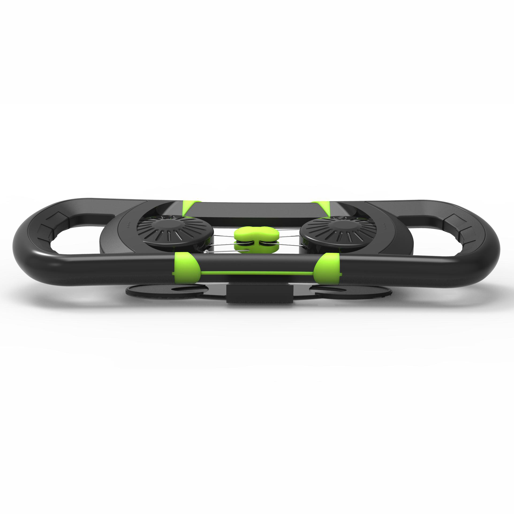
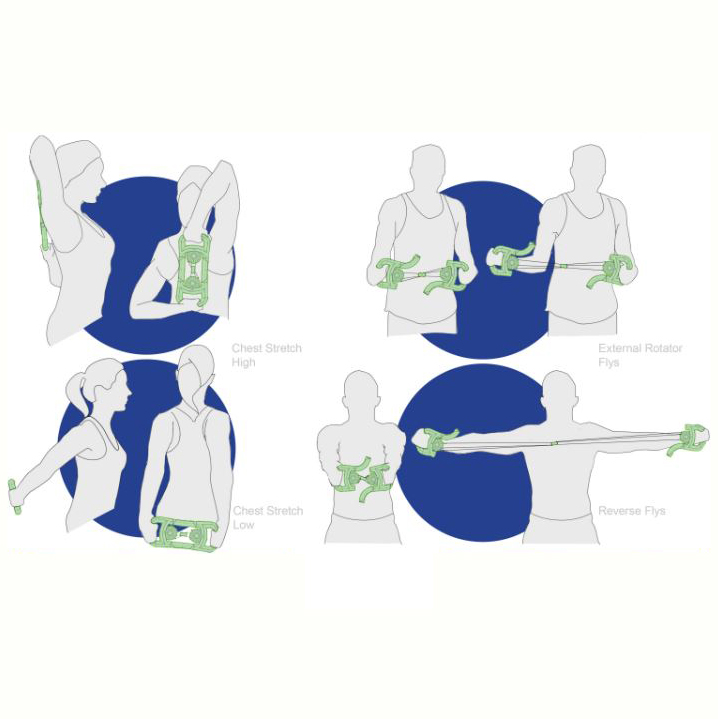
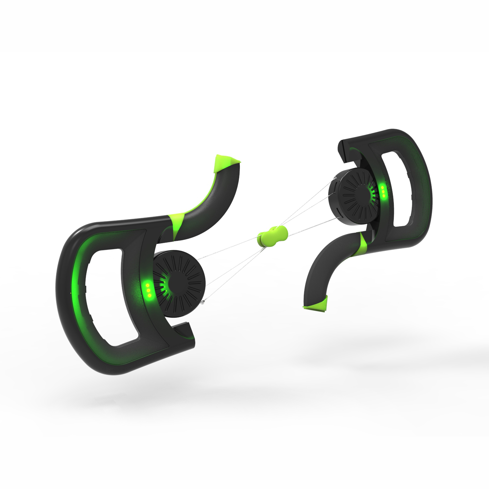
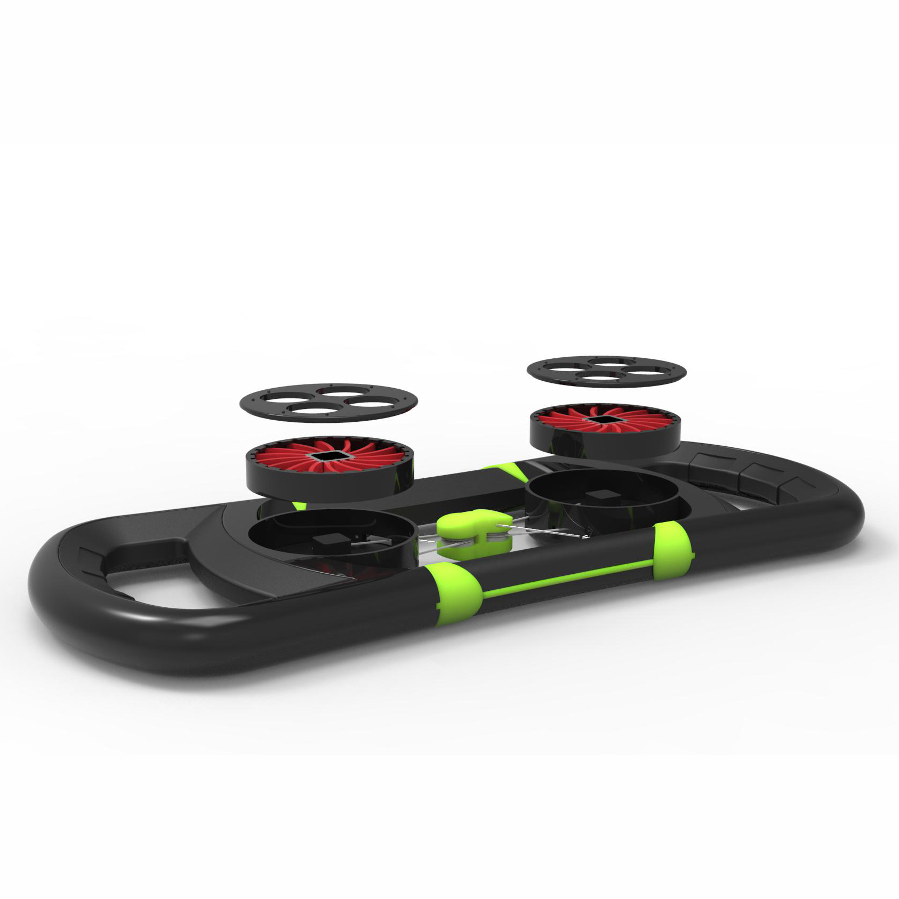

Product Concept
Improving posture for office users
With an increasingly technological world good posture is becoming rarer. bACH puts posture in the workplace front and center.

The user is coached and reminded throughout the day with mobile portal. Stretches across the pectoral muscles lengthen the tight chest muscles whilst the pulley system works to strengthen the often neglected back muscles.

The design of the product is sleek, suitable for display in a luxury office environment.

The resistance of the pulleys can be modified to suit the different needs of the consumer.",

