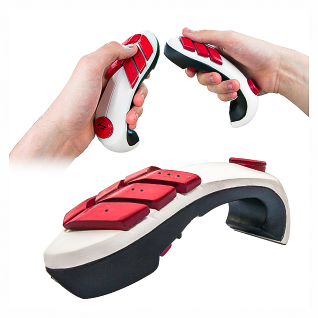
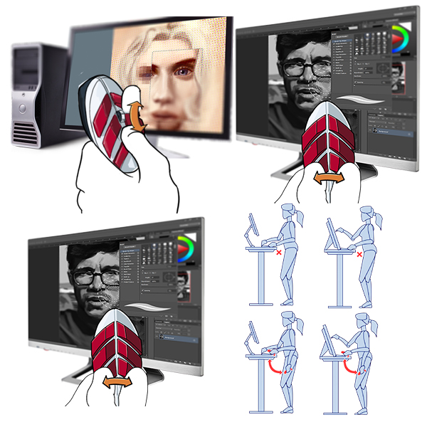
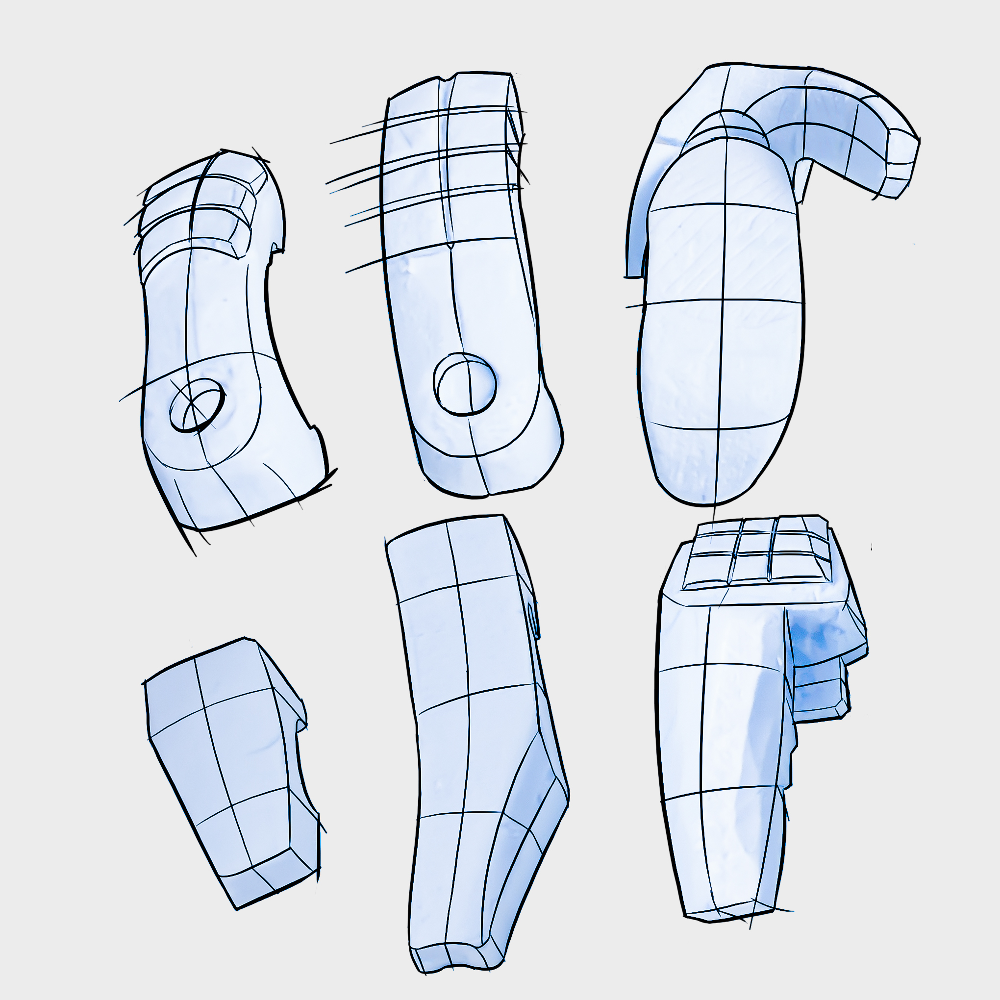

Product Concept",
Ergonomic and user design
Tool for digital artist using a standing desk. Digital artist rely heavily on the use of shortcuts to speed up their workflow. However with a standing desk these shortcuts become difficult to reach. This product aims to fill that gap in the market by providing a hyper customisable, controller for all your shortcut needs.

Marketed at digital painters and illustrators. The device will have many programmable buttons that optimise the workflow of the user.

Many prototypes were produced to optimise the comfort of the device.

